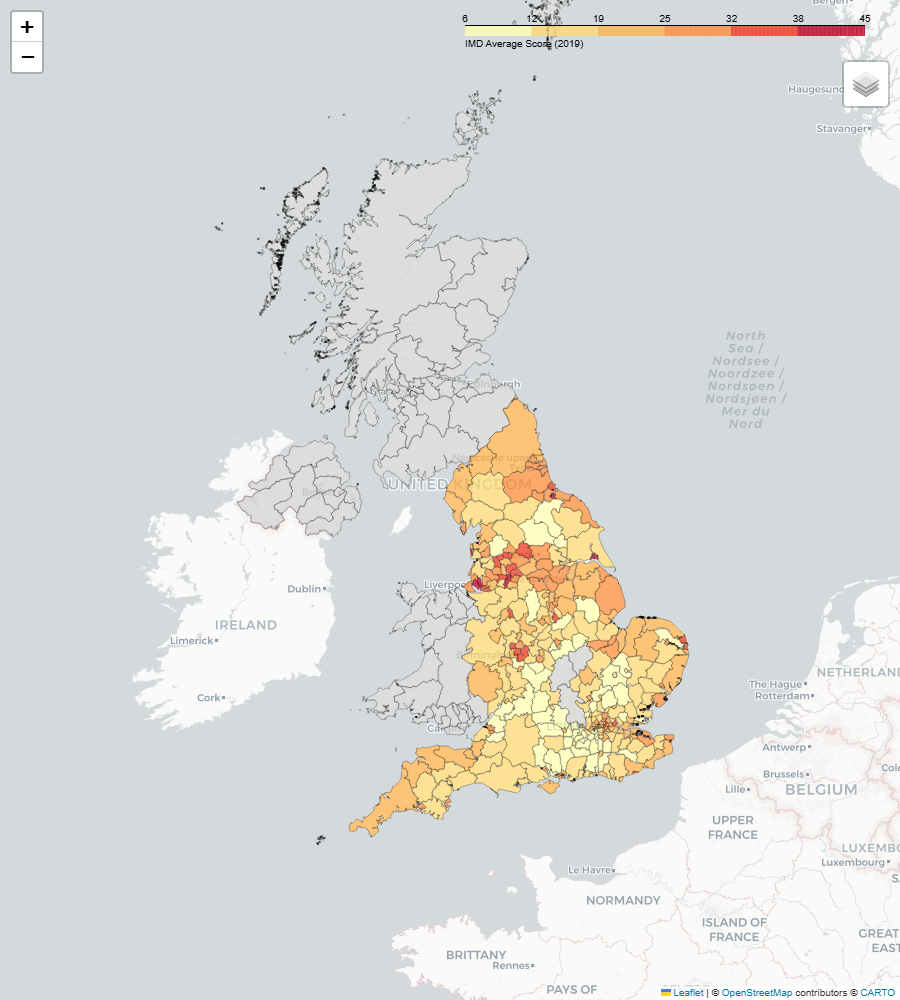
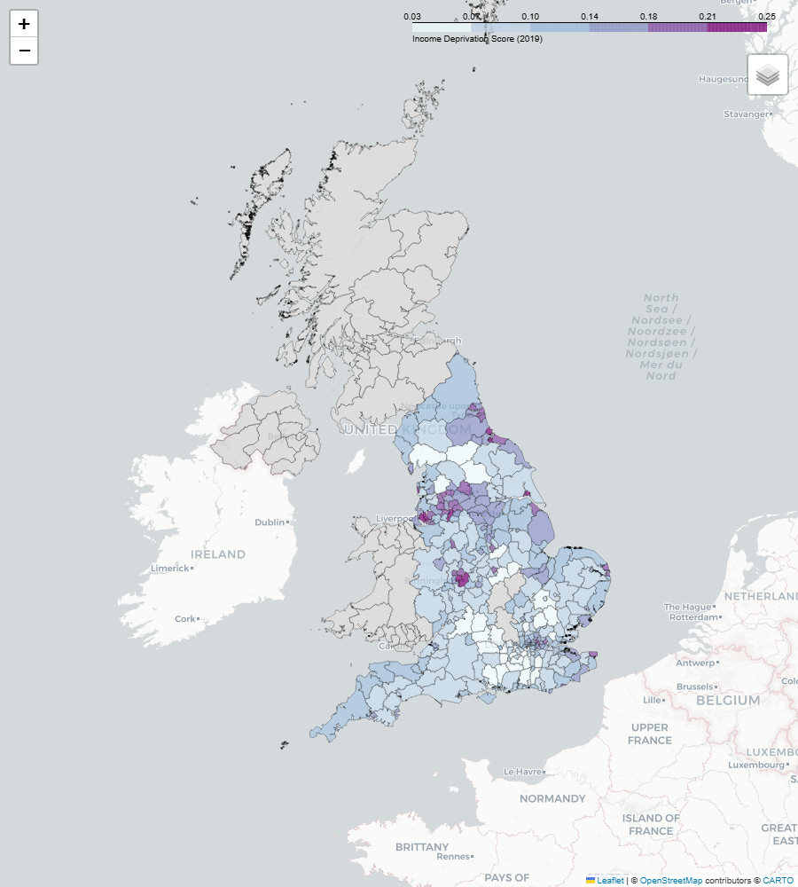
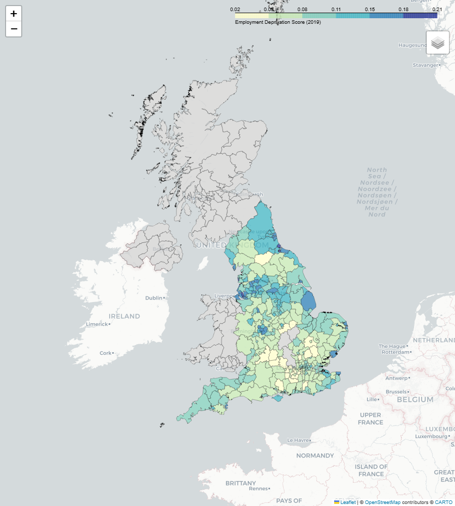

# uk-choropleth-maps

Interactive and static choropleth maps of UK Local Authority statistics, built with [Folium](https://python-visualization.github.io/folium/) and [Plotly Express](https://plotly.com/python/plotly-express/).

Maps are exported as self-contained `.html` files — download and open locally, no server required.

## Maps Produced

Three different English deprivation metrics (IMD 2019 domain scores), all keyed on
the LA district code, plus a Plotly Express comparison:

| Map | Metric | Tool | Output |
|---|---|---|---|
| Index of Multiple Deprivation | IMD average score | Folium | `outputs/maps/imd_map.html` |
| Income deprivation | Income domain score | Folium | `outputs/maps/income_map.html` |
| Employment deprivation | Employment domain score | Folium | `outputs/maps/employment_map.html` |
| IMD (comparison) | IMD average score | Plotly Express | `outputs/maps/imd_plotly.html` |

Boundaries are ONS December 2022 Local Authority Districts (UK), generalised on the
fly so each self-contained HTML stays small.

### Previews

| IMD | Income | Employment |
|---|---|---|
|  |  |  |

## Quick Start

```bash
pip install -r requirements.txt

# Download the ONS boundary GeoJSON + IMD 2019 workbook
python data/download_data.py

# Run the notebook (regenerates all four HTML maps)
jupyter lab notebooks/map_exploration.ipynb

# Or use the builder directly
python -c "
import pandas as pd
from src.choropleth_builder import ChoroplethBuilder
imd = pd.read_excel('data/imd_2019.xlsx', sheet_name='IMD')
imd.columns = [c.strip() for c in imd.columns]
df = imd[['Local Authority District code (2019)', 'IMD - Average score']]
df.columns = ['LAD22CD', 'imd_score']
b = ChoroplethBuilder('data/geojson/local_authorities_2022.geojson', df, join_key='LAD22CD')
b.build(column='imd_score', legend_name='IMD Score')
b.save('outputs/maps/imd_map.html')
"
```

## `ChoroplethBuilder` API

```python
from src.choropleth_builder import ChoroplethBuilder

builder = ChoroplethBuilder(
    geojson_path="data/geojson/local_authorities.geojson",
    data=df,           # pandas DataFrame
    join_key="lad19cd" # column in both GeoJSON and df that links them
)

folium_map = builder.build(
    column="imd_score",      # metric column in df
    legend_name="IMD Score", # label for map legend
    fill_color="YlOrRd",     # Brewer colour scale
    tiles="CartoDB positron" # base tile layer
)
folium_map.save("outputs/maps/imd_map.html")
```

## Data Sources

| Dataset | Source | Licence |
|---|---|---|
| Local Authority Districts (Dec 2022, UK) GeoJSON | ONS Open Geography Portal | OGL v3 |
| Index of Multiple Deprivation 2019 (LA summaries) | MHCLG / data.gov.uk | OGL v3 |

The IMD workbook's per-domain sheets (`IMD`, `Income`, `Employment`) supply the three
mapped metrics. IMD 2019 covers England only, so non-English authorities render grey.

## Project Structure

```
uk-choropleth-maps/
├── notebooks/
│   └── map_exploration.ipynb  # EDA + all 3 maps
├── src/
│   └── choropleth_builder.py  # ChoroplethBuilder class
├── data/
│   ├── download_data.py       # Fetch GeoJSON + CSVs
│   ├── geojson/               # UK LA boundary files (git-ignored)
│   └── README.md              # Data source provenance
├── outputs/
│   └── maps/                  # Exported .html maps (git-ignored)
├── tests/
│   └── test_builder.py
├── requirements.txt
└── pyproject.toml
```

## Licence

Code: MIT. Data: Open Government Licence v3.0.
